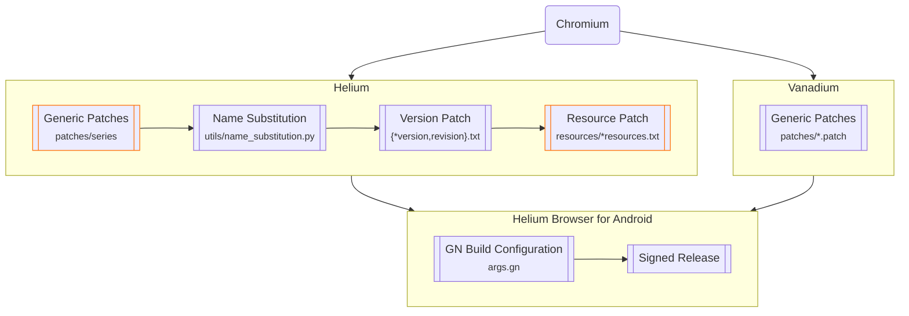

# Helium Browser for Android

An experimental Chromium-based web browser for Android with extensions support, based on
- [Vanadium](https://github.com/GrapheneOS/Vanadium) by [GrapheneOS](https://github.com/GrapheneOS)
- [Helium](https://github.com/imputnet/helium) by [imput](https://github.com/imputnet) (future patches pending GPLv2 compatibility)

## Usage

### Installing Extensions

You can install extensions from the following sources:
- [Chrome Web Store (Recommended)](https://chromewebstore.google.com/)
- [Opera Add-ons](https://addons.opera.com/)
- [Microsoft Edge Add-ons](https://microsoftedge.microsoft.com/addons/)

You can also install from local CRX (or ZIP) file in the options page of the built-in [**Helium Extension for Android**](https://github.com/jqssun/android-titanium-extension).

Additionally, you can load an unpacked extension manually for testing purposes by navigating to [`chrome://extensions`](chrome://extensions). Enable **Developer mode**, select **Load unpacked**, and choose the folder containing the extension in the Storage Access Framework (SAF) picker. It may take a moment for the extension to load.

### Using Extensions

To use [an extension's popup](https://developer.chrome.com/docs/extensions/develop/ui/add-popup), open extensions menu, select the menu button <kbd>⋮</kbd> next to the extension, and choose **Pin to toolbar** from the list. You can then open the popup using the extension's dedicated toolbar icon. 

To run an extension in Incognito (OTR) mode, go to **Manage extensions**, find the extension you want to use in Incognito mode, select **Details**, and turn on **Allow in Incognito**.

Manifest V2 (MV2) extensions are supported. You can install [uBlock Origin from Chrome Web Store](https://chromewebstore.google.com/detail/ublock-origin/cjpalhdlnbpafiamejdnhcphjbkeiagm). For advanced features including external download manager, enhanced dark mode, and additional privacy options, you can use the built-in [**Helium Extension for Android**](https://github.com/jqssun/android-titanium-extension).

### Debug URLs

To view and access the debug URLs, use [`chrome://chrome-urls`](chrome://chrome-urls). For **Experiments**, use [`chrome://flags`](chrome://flags).

### WebRTC IP Policy

Consistent with both Helium and Vanadium, the option is available by selecting the menu button <kbd>⋮</kbd> in the top right corner, then **Settings**, **Privacy and security**, then under **Privacy**, **WebRTC IP handling policy**. If you experience issues with WebRTC due to the IPs being shielded by default (e.g. [Discord Voice](https://discord.com/blog/how-discord-handles-two-and-half-million-concurrent-voice-users-using-webrtc)), you may try to change it to **Default public interface only**, or **Default**.

## Implementation

> [!WARNING]
> All builds are experimental, so unexpected issues may occur. [Helium Browser for Android](#helium-browser-for-android) only attempts to improve security and privacy where possible. For better protection on Android, you should instead use [GrapheneOS](https://grapheneos.org) with [Vanadium](https://vanadium.app), which additionally integrates patches into Android System WebView and provides significant kernel and memory management hardening on the OS level.

All [Vanadium](https://github.com/GrapheneOS/Vanadium) patches are applied by default. While the full build aims to be consistent with [Helium](https://github.com/imputnet/helium-linux), downstream implementation of Helium patches is currently paused to ensure strict compliance with upstream licensing requirements. The diagram reflects the architecture of initial ported releases and serves as the target framework if resolution is achieved.

## Building

This repository provides the build script to compile on the latest Ubuntu, and may also work with other Linux distributions.

See [BUILDING.zh-CN.md](BUILDING.zh-CN.md) for the Chinese local build, incremental build, proxy, signing, and output instructions.

To build these releases yourself via CI (e.g. GitHub Actions), fork this repository. Supply your `base64` encoded `keystore.jks` and `local.properties` (containing your `keyAlias`, `keyPassword` and `storePassword`) to [**Repository secrets**](https://github.com/jqssun/android-helium-browser/blob/main/.github/workflows/build.yml#L47-L48) under **Settings** > **Secrets and variables** > **Actions**. To generate a release, go to **Actions**, select **Build**, and select **Run workflow**. Under **Runner**, you can either use a GitHub-hosted runner by entering `ubuntu-latest`, or `self-hosted` for your own hardware.

## Credits

This project would not have been possible without the huge community contributions from [Vanadium](https://github.com/GrapheneOS/Vanadium), [Helium](https://github.com/imputnet/helium), as well as [ungoogled-chromium](https://github.com/ungoogled-software/ungoogled-chromium) and various other upstream projects. All credit goes to the original authors and contributors. This project started around the same time as [Helium Browser for Linux](https://github.com/imputnet/helium-linux) but it is not officially affiliated with the upstream [Helium](https://github.com/imputnet/helium) project.

## diffent things
Here are the changes/updates I've made:

Extension Support: Enhanced the project to support CRX/ZIP archives, whereas it previously only supported loading unpacked extensions.

Extension UI/UX: Improved the interaction flow. Previously, extension options could only be accessed if the extension was pinned to the address bar. I have updated it so that clicking the Extension Icon and then selecting the specific extension will expand its options.

Dark Mode: Implemented tweaks/fixes for Dark Mode.

Developer Tools Integration: Docked the Developer Tools into the main window. It previously opened in a separate window, which made it impossible to inspect elements within the monitored window.

Special thanks to linux.do (https://linux.do/) for providing the platform and the related community-contributed sites.
